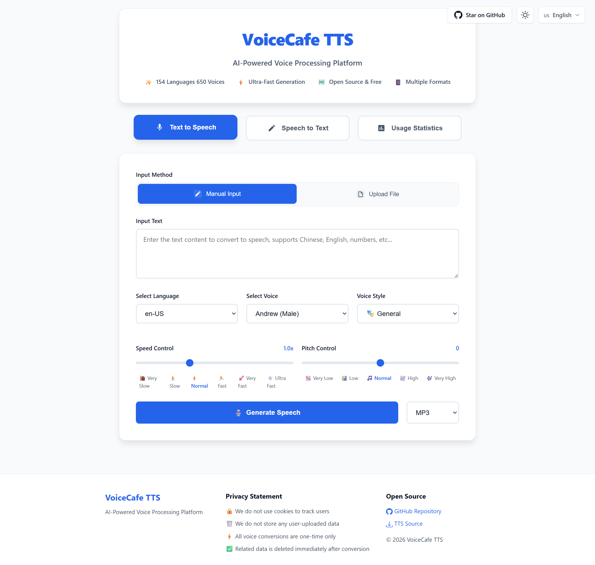

# 🎙️ VoiceCafe TTS - AI-Powered Voice Processing Platform

[English](README.md) | [简体中文](docs/README_zh-CN.md) | [繁體中文](docs/README_zh-TW.md) | [日本語](docs/README_ja.md)

A powerful AI voice processing platform that integrates Text-to-Speech (TTS) and Speech-to-Text (STT) capabilities. Built on Microsoft Edge TTS and SiliconFlow API, supporting 650+ voice options across 154 languages.

**🌐 Live Demo**: [https://tts.reincarnatey.net/](https://tts.reincarnatey.net/)

## 📸 Screenshots



## ✨ Features

### 🎯 Core Capabilities
- 🗣️ **Text-to-Speech (TTS)** - Powered by Microsoft Edge TTS with 650+ voices across 154 languages
- 🎧 **Speech-to-Text (STT)** - Integrated with SiliconFlow API for high-accuracy speech recognition
- 🔄 **Bidirectional Processing** - Seamless conversion between voice and text
- 🌍 **Multilingual Support** - 9 UI languages: English, Simplified Chinese, Traditional Chinese, Japanese, Korean, Spanish, French, German, Russian

### 🎨 User Experience
- ⚡ **Lightning Fast** - Generate high-quality audio and transcriptions in seconds
- 🆓 **Completely Free** - No registration required, unlimited usage
- 📱 **Responsive Design** - Perfect adaptation for desktop and mobile devices
- 🎛️ **Rich Parameters** - Adjustable speed, pitch, voice style, and more
- 📥 **Download Support** - Export generated audio in MP3, WAV, and other formats
- 📋 **Convenient Operations** - Copy, edit transcription results, convert to speech

### 🔧 Technical Features
- 🔗 **API Compatible** - OpenAI TTS API format compatibility
- 🎵 **Multiple Audio Formats** - Support for MP3, WAV, M4A, FLAC, AAC, OGG, WebM, AMR, 3GP
- 🔐 **Flexible Configuration** - Support for default and custom API tokens
- 🎨 **Modern UI** - Elegant card-based design with intuitive mode switching
- 📊 **Optional Statistics** - KV/D1 storage-based usage statistics (disabled by default)
- 📥 **TTS Source Export** - Export TTS configuration for third-party software

## 🚀 Quick Deploy

### Deploy to Cloudflare Workers with One Click

[](https://deploy.workers.cloudflare.com/?url=https://github.com/Raincarnator/VoiceCafe-TTS)

**Note**: After deployment, you need to configure environment variables to enable Speech-to-Text (STT) and statistics features. See the [Configuration](#️-configuration) section for details.

## 📖 Usage

### 🌐 Web Interface

#### Text-to-Speech Mode
1. Visit your deployed Worker domain
2. Ensure you're in "Text to Speech" mode (default)
3. Choose input method: manual input or upload .txt file
4. Enter text or upload a file
5. Select voice, speed, pitch, style, and other parameters
6. Click "Generate Speech" button
7. Play the generated audio or download as MP3

#### Speech-to-Text Mode
1. Click "Speech to Text" button at the top to switch modes
2. Upload audio file (supports 9 formats, max 25MB)
3. Use default API Token or enter custom API Token
4. Click "Start Transcription" button
5. View transcription results, copy, edit, or convert to speech

#### 🌍 Language Switching
- Click the language switcher in the top-right corner
- Supports 9 languages with automatic preference saving
- UI language automatically maps to corresponding TTS locale

### 🔌 API Usage

#### Text-to-Speech API

**Endpoint**: `POST /v1/audio/speech`

```javascript
// JavaScript Example
const response = await fetch('https://your-worker.workers.dev/v1/audio/speech', {
    method: 'POST',
    headers: {
        'Content-Type': 'application/json',
    },
    body: JSON.stringify({
        input: "Hello, this is a test",
        voice: "en-US-JennyNeural",
        speed: 1.0,
        pitch: "0",
        style: "general",
        response_format: "mp3"
    })
});

const audioBlob = await response.blob();
```

```bash
# cURL Example
curl -X POST "https://your-worker.workers.dev/v1/audio/speech" \
  -H "Content-Type: application/json" \
  -d '{
    "input": "Hello, this is a test",
    "voice": "en-US-JennyNeural",
    "speed": 1.0,
    "pitch": "0",
    "style": "general",
    "response_format": "mp3"
  }' \
  --output speech.mp3
```

**Parameters**:

| Parameter | Type | Default | Description |
|-----------|------|---------|-------------|
| `input` | string | - | Text content to convert (required) |
| `voice` | string | `en-US-JennyNeural` | Voice selection |
| `speed` | number | `1.0` | Speech rate (0.5-2.0) |
| `pitch` | string | `"0"` | Pitch adjustment (-50 to 50) |
| `style` | string | `"general"` | Voice style |
| `response_format` | string | `"mp3"` | Output format (mp3, wav, opus, flac, aac, ogg, webm, amr, 3gp) |

#### Speech-to-Text API

**Endpoint**: `POST /v1/audio/transcriptions`

```javascript
// JavaScript Example
const formData = new FormData();
formData.append('file', audioFile); // Audio file
formData.append('token', 'your-siliconflow-token'); // Optional if env var is set

const response = await fetch('https://your-worker.workers.dev/v1/audio/transcriptions', {
    method: 'POST',
    body: formData
});

const result = await response.json();
console.log(result.text); // Transcription result
```

```bash
# cURL Example
curl -X POST "https://your-worker.workers.dev/v1/audio/transcriptions" \
  -F "file=@audio.mp3" \
  -F "token=your-siliconflow-token"
```

**Parameters**:

| Parameter | Type | Default | Description |
|-----------|------|---------|-------------|
| `file` | File | - | Audio file (required, multiple formats supported) |
| `token` | string | env var | SiliconFlow API Token (optional if configured in environment) |

**Supported Audio Formats**: mp3, wav, m4a, flac, aac, ogg, webm, amr, 3gp (max 25MB)

#### Voice List API

**Endpoint**: `GET /v1/voices?locale={locale}`

```bash
# Get all voices
curl https://your-worker.workers.dev/v1/voices

# Get voices for specific locale
curl https://your-worker.workers.dev/v1/voices?locale=en-US
```

#### Locale List API

**Endpoint**: `GET /v1/locales`

```bash
curl https://your-worker.workers.dev/v1/locales
```

#### TTS Source Export API

**Endpoint**: `GET /tts.json?lang={locales}`

```bash
# Export all languages
curl https://your-worker.workers.dev/tts.json

# Export specific language
curl https://your-worker.workers.dev/tts.json?lang=en-US

# Export multiple languages
curl https://your-worker.workers.dev/tts.json?lang=en-US+zh-CN
```

#### Statistics API (if enabled)

**Endpoint**: `GET /v1/stats`

```bash
curl https://your-worker.workers.dev/v1/stats
```

## ⚙️ Configuration

### Method 1: Web Console Configuration (For One-Click Deployment)

Applicable scenario: After deploying with the one-click deployment button, or when you need to modify an already deployed Worker configuration.

#### Step 1: Configure Environment Variables (Optional)

If you need to enable default STT functionality or Google Analytics, configure the following environment variables:

1. Log in to [Cloudflare Dashboard](https://dash.cloudflare.com/)
2. Select **Compute → Workers & Pages**
3. Click your Worker to enter the details page
4. Select the **Settings** tab
5. In the **Variables and Secrets** section, click **Add**
6. Configure the variable in the right sidebar:
   - **Type**: Select `Text` (regular variable) or `Secret` (sensitive information, recommended for API Keys)
   - **Variable name**: Enter the variable name (e.g., `SILICONFLOW_API_KEY`)
   - **Value**: Enter the variable value (e.g., `sk-xxxxx`)
7. Click **Deploy** in the bottom right to complete the addition

**Optional Environment Variable Configuration**:

| Variable Name | Type | Description | Example Value | Default |
|---------------|------|-------------|---------------|---------|
| `SILICONFLOW_API_KEY` | Secret | SiliconFlow API key for enabling default speech-to-text functionality. If not configured, users need to provide a custom API Key when using STT. Get API key from [SiliconFlow](https://cloud.siliconflow.cn/) | `sk-xxxxx` | None |
| `STATS_TYPE` | Text | Statistics mode | `none`, `kv`, `d1` | `none` |
| `GA_MEASUREMENT_ID` | Text | Google Analytics Measurement ID | `G-XXXXXXXXXX` | None |

#### Step 2: Configure Statistics Feature (Optional)

**Option A: Disable Statistics (Default)**

No configuration needed, statistics feature is disabled by default.

**Option B: Enable KV Storage Statistics**

1. In Cloudflare Dashboard, select **Storage & databases → Workers KV**
2. Click **Create Instance**
3. In **Namespace name**, enter a name (e.g., `voicecafe-stats` or custom name)
4. Click **Create** to create the namespace
5. Return to **Compute → Workers & Pages**, select your Worker
6. Select the **Bindings** tab
7. Click **Add binding**, select **KV namespace**
8. Click **Add Binding**
9. In the popup configuration:
   - **Variable name**: Enter `STATS_KV` (fixed, do not modify)
   - **KV namespace**: Select the namespace you just created
10. Click **Add Binding** to complete the binding
11. Return to the **Settings** tab, in the **Variables and Secrets** section:
    - If `STATS_TYPE` variable already exists: Click the edit button, modify **Value** to `kv`, click **Deploy** in the bottom right
    - If `STATS_TYPE` variable doesn't exist: Click **Add**, in the right sidebar select **Type** as `Text`, **Variable name** as `STATS_TYPE`, **Value** as `kv`, click **Deploy** in the bottom right

**Option C: Enable D1 Database Statistics (Recommended)**

1. In Cloudflare Dashboard, select **Storage & databases → D1 SQL database**
2. Click **Create Database**
3. In **Name**, enter a name (e.g., `voicecafe-stats` or custom name)
4. Click **Create** to create the database
5. Return to **Compute → Workers & Pages**, select your Worker
6. Select the **Bindings** tab
7. Click **Add binding**, select **D1 database**
8. Click **Add Binding**
9. In the popup configuration:
   - **Variable name**: Enter `STATS_DB` (fixed, do not modify)
   - **D1 database**: Select the database you just created
10. Click **Add Binding** to complete the binding
11. Return to the **Settings** tab, in the **Variables and Secrets** section:
    - If `STATS_TYPE` variable already exists: Click the edit button, modify **Value** to `d1`, click **Deploy** in the bottom right
    - If `STATS_TYPE` variable doesn't exist: Click **Add**, in the right sidebar select **Type** as `Text`, **Variable name** as `STATS_TYPE`, **Value** as `d1`, click **Deploy** in the bottom right

**Note**: Database tables will be automatically created on first use, no manual initialization required.

### Method 2: wrangler.toml + Command Line Configuration (For Local Deployment)

Applicable scenario: Deploying from local using the `wrangler deploy` command.

#### Step 1: Configure wrangler.toml

Edit the `wrangler.toml` file in the project root directory:

```toml
[vars]
# Statistics mode: "none" (default), "kv", or "d1"
STATS_TYPE = "none"

# Google Analytics Measurement ID (optional)
GA_MEASUREMENT_ID = "G-XXXXXXXXXX"
```

#### Step 2: Configure SiliconFlow API Key (Optional)

To enable default STT functionality, use the `wrangler secret` command to configure (recommended, key won't be exposed in config file):

```bash
wrangler secret put SILICONFLOW_API_KEY
# Enter your API Key when prompted
```

Or configure in `wrangler.toml` (for local development testing only):

```toml
[vars]
SILICONFLOW_API_KEY = "your-api-key-here"  # Note: Do not commit to Git
```

**Note**: If this API Key is not configured, users need to provide a custom API Key when using STT functionality.

#### Step 3: Configure Statistics Feature (Optional)

**Option A: Disable Statistics (Default)**

Keep `STATS_TYPE = "none"`, no other configuration needed.

**Option B: Enable KV Storage Statistics**

1. Create KV namespace:

```bash
# Create production KV namespace (name can be customized, e.g., voicecafe-stats)
wrangler kv namespace create "voicecafe-stats"
# Output example: id = "abc123def456..."

# Create preview KV namespace (for local development)
wrangler kv namespace create "voicecafe-stats" --preview
# Output example: preview_id = "xyz789uvw012..."
```

2. Configure in `wrangler.toml`:

```toml
[vars]
STATS_TYPE = "kv"

[[kv_namespaces]]
binding = "STATS_KV"
id = "abc123def456..."              # Replace with the id from the command output
preview_id = "xyz789uvw012..."      # Replace with the preview_id from the command output
```

**Parameter Description**:
- `binding`: Binding name, accessed in code via `env.STATS_KV`, **fixed as STATS_KV, do not modify**
- `id`: Production environment ID of the KV namespace
- `preview_id`: Preview environment ID of the KV namespace, for local development

**View existing KV namespaces**:
```bash
wrangler kv namespace list
```

**Option C: Enable D1 Database Statistics (Recommended)**

1. Create D1 database:

```bash
# Database name can be customized, e.g., voicecafe-stats
wrangler d1 create voicecafe-stats
# Output example: database_id = "12345678-abcd-1234-abcd-123456789abc"
```

2. Configure in `wrangler.toml`:

```toml
[vars]
STATS_TYPE = "d1"

[[d1_databases]]
binding = "STATS_DB"
database_name = "voicecafe-stats"
database_id = "12345678-abcd-1234-abcd-123456789abc"  # Replace with the database_id from the command output
```

**Parameter Description**:
- `binding`: Binding name, accessed in code via `env.STATS_DB`, **fixed as STATS_DB, do not modify**
- `database_name`: Database name, can be customized (e.g., voicecafe-stats)
- `database_id`: Unique identifier of the D1 database

**View existing D1 databases**:
```bash
wrangler d1 list
```

**Automatic Table Creation**: On first use, the system will automatically create the required statistics tables.

## 🏗️ Architecture

### Technology Stack

**Frontend**:
- Modern HTML5 + CSS3 + Vanilla JavaScript
- No external dependencies (statistics charts use ECharts dynamically loaded)
- Responsive design with CSS variables
- Built-in internationalization (9 languages)
- ECharts for statistics data visualization (heatmap and trend charts)

**Backend**:
- Cloudflare Workers (Edge Computing)
- Modular architecture with clear separation of concerns
- Service-oriented design pattern

**TTS Engine**:
- Microsoft Edge TTS
- 650+ voices across 154 languages
- Multiple voice styles and adjustable parameters

**STT Engine**:
- SiliconFlow FunAudioLLM/SenseVoiceSmall
- High-accuracy speech recognition
- Multiple audio format support

**Storage** (Optional):
- Cloudflare KV for simple key-value statistics
- Cloudflare D1 for relational database statistics

### Project Structure

```
├── src/
│   ├── config/              # Configuration files
│   │   └── constants.js     # Constants definition
│   ├── data/                # Static data
│   │   └── voices-data.js   # Voice database
│   ├── handlers/            # Request handlers
│   │   ├── stt-handler.js   # Speech-to-text handler
│   │   ├── tts-handler.js   # Text-to-speech handler
│   │   ├── voices-handler.js # Voice list handler
│   │   ├── stats-handler.js  # Statistics handler
│   │   └── tts-source-handler.js # TTS source export handler
│   ├── services/            # Core services
│   │   ├── tts.js           # TTS service
│   │   ├── stt.js           # STT service
│   │   ├── stats-service.js # Statistics service abstraction
│   │   ├── kv-stats-service.js # KV statistics implementation
│   │   ├── d1-stats-service.js # D1 statistics implementation
│   │   └── stats-factory.js # Statistics service factory
│   ├── utils/               # Utility functions
│   │   ├── cors.js          # CORS headers utility
│   │   ├── crypto.js        # Encryption utility
│   │   ├── html-loader.js   # HTML loader
│   │   ├── text.js          # Text processing utility
│   │   └── xml.js           # XML processing utility
│   └── templates/           # HTML templates
│       ├── index.html       # Main HTML template
│       └── html-template.js # Generated template (auto-generated)
├── docs/                    # Documentation
│   ├── img/                 # Screenshots
│   ├── README_zh-CN.md      # Simplified Chinese README
│   ├── README_zh-TW.md      # Traditional Chinese README
│   └── README_ja.md         # Japanese README
├── index.js                 # Main entry point
├── build.js                 # Build script
├── package.json             # Project configuration
├── wrangler.toml            # Cloudflare Workers configuration
└── README.md                # This file
```

### Design Patterns

- **Service Layer**: Abstraction for TTS, STT, and statistics services
- **Factory Pattern**: Statistics service factory for different storage backends
- **Handler Pattern**: Modular request handlers for different endpoints
- **Template Generation**: Build-time HTML template generation with variable injection

## 🛠️ Development

### Prerequisites

- Node.js 16+
- npm or yarn
- Cloudflare account (for deployment)
- SiliconFlow API key (optional, for STT functionality)

### Local Development

```bash
# Clone the repository
git clone https://github.com/Raincarnator/VoiceCafe-TTS.git
cd VoiceCafe-TTS

# Install dependencies
npm install

# Configure environment variables
# Edit wrangler.toml file, configure STATS_TYPE, SILICONFLOW_API_KEY, etc. as needed

# Build the project (generates HTML template)
npm run build

# Start local development server
npm run dev
```

Visit http://localhost:8787 to see the application.

### Deployment

```bash
# Deploy to Cloudflare Workers
npm run deploy

# Set production secrets (recommended to use secret instead of writing in wrangler.toml)
wrangler secret put SILICONFLOW_API_KEY
```

**Production Configuration Recommendations**:
- Sensitive information (such as `SILICONFLOW_API_KEY`) should use the `wrangler secret` command or be configured in the Cloudflare console
- Non-sensitive configuration (such as `STATS_TYPE`, `GA_MEASUREMENT_ID`) can be written in the `[vars]` section of `wrangler.toml`

### Build Process

The build script (`build.js`) reads the HTML template from `src/templates/index.html` and generates `src/templates/html-template.js` with:
- Escaped template strings
- Google Analytics injection support
- Statistics enabled flag injection

Run `npm run build` after modifying the HTML template.

## 🤝 Contributing

Contributions are welcome! Please feel free to submit a Pull Request.

### How to Contribute

1. Fork the repository
2. Create your feature branch (`git checkout -b feature/AmazingFeature`)
3. Commit your changes (`git commit -m 'Add some AmazingFeature'`)
4. Push to the branch (`git push origin feature/AmazingFeature`)
5. Open a Pull Request

### Development Guidelines

- Follow the existing code style
- Add comments for complex logic
- Update documentation for new features
- Test thoroughly before submitting PR

## 📄 License

This project is licensed under the MIT License - see the [LICENSE](LICENSE) file for details.

## 🙏 Acknowledgments

This project is based on and inspired by:

- **[wangwangit/tts](https://github.com/wangwangit/tts)** - Original TTS project foundation
- **[Microsoft Edge TTS](https://azure.microsoft.com/en-us/products/ai-services/text-to-speech)** - High-quality voice synthesis service
- **[SiliconFlow](https://cloud.siliconflow.cn/)** - Advanced speech recognition API
- **[Cloudflare Workers](https://workers.cloudflare.com/)** - Serverless computing platform
- **Open Source Community** - Thanks to all contributors and users

## 📞 Contact & Support

- **GitHub Issues**: [Report bugs or request features](https://github.com/Raincarnator/VoiceCafe-TTS/issues)
- **GitHub Discussions**: [Ask questions or share ideas](https://github.com/Raincarnator/VoiceCafe-TTS/discussions)

---

**🎙️ VoiceCafe TTS - Making Voice Processing Smarter, Making Creativity More Vocal!**

*From text to speech, from speech to text - AI-powered complete voice processing solution.*
