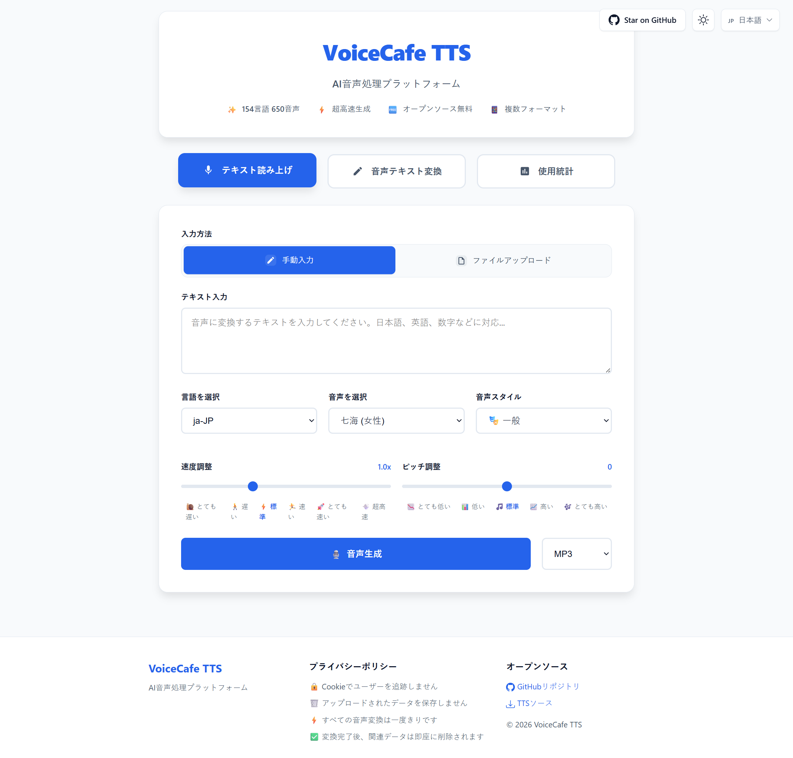

# 🎙️ VoiceCafe TTS - AI駆動の音声処理プラットフォーム

[English](../README.md) | [简体中文](README_zh-CN.md) | [繁體中文](README_zh-TW.md) | [日本語](README_ja.md)

テキスト読み上げ(TTS)と音声テキスト変換(STT)の双方向機能を統合した強力なAI音声処理プラットフォーム。Microsoft Edge TTSとSiliconFlow APIをベースに、154言語で650以上の音声オプションをサポート。

**🌐 ライブデモ**: [https://tts.reincarnatey.net/](https://tts.reincarnatey.net/)

## 📸 スクリーンショット



## ✨ 機能

### 🎯 コア機能
- 🗣️ **テキスト読み上げ(TTS)** - Microsoft Edge TTSベース、154言語で650以上の音声をサポート
- 🎧 **音声テキスト変換(STT)** - SiliconFlow API統合、高精度音声認識
- 🔄 **双方向処理** - 音声とテキストのシームレスな変換
- 🌍 **多言語サポート** - 9つのUI言語：英語、簡体字中国語、繁体字中国語、日本語、韓国語、スペイン語、フランス語、ドイツ語、ロシア語

### 🎨 ユーザーエクスペリエンス
- ⚡ **高速生成** - 高品質な音声ファイルとテキスト変換を数秒で生成
- 🆓 **完全無料** - 登録不要、無制限使用
- 📱 **レスポンシブデザイン** - デスクトップとモバイルデバイスに完全対応
- 🎛️ **豊富なパラメータ** - 速度、ピッチ、音声スタイルなど多様な調整が可能
- 📥 **ダウンロードサポート** - 生成された音声をMP3、WAVなど複数の形式でエクスポート
- 📋 **便利な操作** - 変換結果のコピー、編集、音声への変換をサポート

### 🔧 技術的特徴
- 🔗 **API互換性** - OpenAI TTS API形式と互換
- 🎵 **複数の音声形式** - MP3、WAV、M4A、FLAC、AAC、OGG、WebM、AMR、3GPをサポート
- 🔐 **柔軟な設定** - デフォルトトークンとカスタムトークン設定をサポート
- 🎨 **モダンUI** - エレガントなカードベースデザイン、直感的なモード切り替え
- 📊 **オプション統計** - KV/D1ストレージベースの使用統計（デフォルトで無効）
- 📥 **TTSソースエクスポート** - サードパーティソフトウェア用のTTS設定エクスポート

## 🚀 クイックデプロイ

### Cloudflare Workersにワンクリックデプロイ

[](https://deploy.workers.cloudflare.com/?url=https://github.com/Raincarnator/VoiceCafe-TTS)

**注意**：デプロイ後、音声テキスト変換(STT)と統計機能を有効にするには環境変数の設定が必要です。詳細は[設定](#️-設定)セクションを参照してください。

## 📖 使用方法

### 🌐 Webインターフェース

#### テキスト読み上げモード
1. デプロイしたWorkerドメインにアクセス
2. 「テキスト読み上げ」モードであることを確認（デフォルト）
3. 入力方法を選択：手動入力または.txtファイルアップロード
4. テキストを入力またはファイルをアップロード
5. 音声、速度、ピッチ、スタイルなどのパラメータを選択
6. 「音声生成」ボタンをクリック
7. 生成された音声を再生またはMP3としてダウンロード

#### 音声テキスト変換モード
1. ページ上部の「音声テキスト変換」ボタンをクリックしてモードを切り替え
2. 音声ファイルをアップロード（9つの形式をサポート、最大25MB）
3. デフォルトAPI Tokenを使用するか、カスタムAPI Tokenを入力
4. 「文字起こし開始」ボタンをクリック
5. 変換結果を表示、コピー、編集、または音声に変換

#### 🌍 言語切り替え
- 右上の言語スイッチャーをクリック
- 9つの言語をサポート、設定を自動保存
- UI言語が対応するTTSロケールに自動マッピング

### 🔌 API使用

#### テキスト読み上げAPI

**エンドポイント**: `POST /v1/audio/speech`

```javascript
// JavaScript例
const response = await fetch('https://your-worker.workers.dev/v1/audio/speech', {
    method: 'POST',
    headers: {
        'Content-Type': 'application/json',
    },
    body: JSON.stringify({
        input: "こんにちは、これはテストです",
        voice: "ja-JP-NanamiNeural",
        speed: 1.0,
        pitch: "0",
        style: "general",
        response_format: "mp3"
    })
});

const audioBlob = await response.blob();
```

```bash
# cURL例
curl -X POST "https://your-worker.workers.dev/v1/audio/speech" \
  -H "Content-Type: application/json" \
  -d '{
    "input": "こんにちは、これはテストです",
    "voice": "ja-JP-NanamiNeural",
    "speed": 1.0,
    "pitch": "0",
    "style": "general",
    "response_format": "mp3"
  }' \
  --output speech.mp3
```

**パラメータ**:

| パラメータ | 型 | デフォルト | 説明 |
|-----------|------|---------|-------------|
| `input` | string | - | 変換するテキスト内容（必須） |
| `voice` | string | `ja-JP-NanamiNeural` | 音声選択 |
| `speed` | number | `1.0` | 速度 (0.5-2.0) |
| `pitch` | string | `"0"` | ピッチ調整 (-50 から 50) |
| `style` | string | `"general"` | 音声スタイル |
| `response_format` | string | `"mp3"` | 出力形式 (mp3, wav, opus, flac, aac, ogg, webm, amr, 3gp) |

#### 音声テキスト変換API

**エンドポイント**: `POST /v1/audio/transcriptions`

```javascript
// JavaScript例
const formData = new FormData();
formData.append('file', audioFile); // 音声ファイル
formData.append('token', 'your-siliconflow-token'); // 環境変数が設定されている場合はオプション

const response = await fetch('https://your-worker.workers.dev/v1/audio/transcriptions', {
    method: 'POST',
    body: formData
});

const result = await response.json();
console.log(result.text); // 変換結果
```

```bash
# cURL例
curl -X POST "https://your-worker.workers.dev/v1/audio/transcriptions" \
  -F "file=@audio.mp3" \
  -F "token=your-siliconflow-token"
```

**パラメータ**:

| パラメータ | 型 | デフォルト | 説明 |
|-----------|------|---------|-------------|
| `file` | File | - | 音声ファイル（必須、複数の形式をサポート） |
| `token` | string | 環境変数 | SiliconFlow APIトークン（環境変数が設定されている場合はオプション） |

**サポートされる音声形式**: mp3, wav, m4a, flac, aac, ogg, webm, amr, 3gp（最大25MB）

#### 音声リストAPI

**エンドポイント**: `GET /v1/voices?locale={locale}`

```bash
# すべての音声を取得
curl https://your-worker.workers.dev/v1/voices

# 特定のロケールの音声を取得
curl https://your-worker.workers.dev/v1/voices?locale=ja-JP
```

#### ロケールリストAPI

**エンドポイント**: `GET /v1/locales`

```bash
curl https://your-worker.workers.dev/v1/locales
```

#### TTSソースエクスポートAPI

**エンドポイント**: `GET /tts.json?lang={locales}`

```bash
# すべての言語をエクスポート
curl https://your-worker.workers.dev/tts.json

# 特定の言語をエクスポート
curl https://your-worker.workers.dev/tts.json?lang=ja-JP

# 複数の言語をエクスポート
curl https://your-worker.workers.dev/tts.json?lang=ja-JP+en-US
```

#### 統計API（有効な場合）

**エンドポイント**: `GET /v1/stats`

```bash
curl https://your-worker.workers.dev/v1/stats
```

## ⚙️ 設定

### 方法1：Webコンソールでの設定（ワンクリックデプロイ用）

適用シナリオ：ワンクリックデプロイボタンでデプロイした後、または既にデプロイされたWorkerの設定を変更する必要がある場合。

#### ステップ1：環境変数の設定（オプション）

デフォルトのSTT機能またはGoogle Analyticsを有効にする必要がある場合は、以下の環境変数を設定します：

1. [Cloudflare Dashboard](https://dash.cloudflare.com/)にログイン
2. **Compute → Workers & Pages**を選択
3. Workerをクリックして詳細ページに入る
4. **Settings**タブを選択
5. **Variables and Secrets**セクションで**Add**をクリック
6. 右側のサイドバーで変数を設定：
   - **Type**: `Text`（通常の変数）または`Secret`（機密情報、API Keyに推奨）を選択
   - **Variable name**: 変数名を入力（例：`SILICONFLOW_API_KEY`）
   - **Value**: 変数値を入力（例：`sk-xxxxx`）
7. 右下の**Deploy**をクリックして追加を完了

**オプション環境変数設定**：

| 変数名 | Type | 説明 | 例/値 | デフォルト |
|--------|------|------|-------|-----------|
| `SILICONFLOW_API_KEY` | Secret | SiliconFlow APIキー、デフォルトの音声テキスト変換機能を有効にするために使用。設定しない場合、ユーザーはSTT使用時にカスタムAPI Keyを提供する必要があります。[SiliconFlow](https://cloud.siliconflow.cn/)からAPIキーを取得 | `sk-xxxxx` | なし |
| `STATS_TYPE` | Text | 統計モード | `none`、`kv`、`d1` | `none` |
| `GA_MEASUREMENT_ID` | Text | Google Analytics測定ID | `G-XXXXXXXXXX` | なし |

#### ステップ2：統計機能の設定（オプション）

**オプションA：統計を無効化（デフォルト）**

設定は不要です。統計機能はデフォルトで無効になっています。

**オプションB：KVストレージ統計を有効化**

1. Cloudflare Dashboardで**Storage & databases → Workers KV**を選択
2. **Create Instance**をクリック
3. **Namespace name**に名前を入力（例：`voicecafe-stats`またはカスタム名）
4. **Create**をクリックしてネームスペースを作成
5. **Compute → Workers & Pages**に戻り、Workerを選択
6. **Bindings**タブを選択
7. **Add binding**をクリックし、**KV namespace**を選択
8. **Add Binding**をクリック
9. ポップアップ設定で：
   - **Variable name**: `STATS_KV`を入力（固定、変更しないでください）
   - **KV namespace**: 作成したネームスペースを選択
10. **Add Binding**をクリックしてバインディングを完了
11. **Settings**タブに戻り、**Variables and Secrets**セクションで：
    - `STATS_TYPE`変数が既に存在する場合：編集ボタンをクリックし、**Value**を`kv`に変更し、右下の**Deploy**をクリック
    - `STATS_TYPE`変数が存在しない場合：**Add**をクリックし、右側のサイドバーで**Type**を`Text`、**Variable name**を`STATS_TYPE`、**Value**を`kv`に設定し、右下の**Deploy**をクリック

**オプションC：D1データベース統計を有効化（推奨）**

1. Cloudflare Dashboardで**Storage & databases → D1 SQL database**を選択
2. **Create Database**をクリック
3. **Name**に名前を入力（例：`voicecafe-stats`またはカスタム名）
4. **Create**をクリックしてデータベースを作成
5. **Compute → Workers & Pages**に戻り、Workerを選択
6. **Bindings**タブを選択
7. **Add binding**をクリックし、**D1 database**を選択
8. **Add Binding**をクリック
9. ポップアップ設定で：
   - **Variable name**: `STATS_DB`を入力（固定、変更しないでください）
   - **D1 database**: 作成したデータベースを選択
10. **Add Binding**をクリックしてバインディングを完了
11. **Settings**タブに戻り、**Variables and Secrets**セクションで：
    - `STATS_TYPE`変数が既に存在する場合：編集ボタンをクリックし、**Value**を`d1`に変更し、右下の**Deploy**をクリック
    - `STATS_TYPE`変数が存在しない場合：**Add**をクリックし、右側のサイドバーで**Type**を`Text`、**Variable name**を`STATS_TYPE`、**Value**を`d1`に設定し、右下の**Deploy**をクリック

**注意**：データベーステーブルは初回使用時に自動的に作成されます。手動での初期化は不要です。

### 方法2：wrangler.toml + コマンドライン設定（ローカルデプロイ用）

適用シナリオ：ローカルから`wrangler deploy`コマンドを使用してデプロイする場合。

#### ステップ1：wrangler.tomlの設定

プロジェクトルートディレクトリの`wrangler.toml`ファイルを編集：

```toml
[vars]
# 統計モード: "none"（デフォルト）、"kv"、または "d1"
STATS_TYPE = "none"

# Google Analytics測定ID（オプション）
GA_MEASUREMENT_ID = "G-XXXXXXXXXX"
```

#### ステップ2：SiliconFlow API Keyの設定（オプション）

デフォルトのSTT機能を有効にするには、`wrangler secret`コマンドを使用して設定します（推奨、キーが設定ファイルに露出しません）：

```bash
wrangler secret put SILICONFLOW_API_KEY
# プロンプトに従ってAPI Keyを入力
```

または`wrangler.toml`で設定（ローカル開発テスト用のみ）：

```toml
[vars]
SILICONFLOW_API_KEY = "your-api-key-here"  # 注意：Gitにコミットしないでください
```

**説明**：このAPI Keyを設定しない場合、ユーザーはSTT機能使用時にカスタムAPI Keyを提供する必要があります。

#### ステップ3：統計機能の設定（オプション）

**オプションA：統計を無効化（デフォルト）**

`STATS_TYPE = "none"`のままにしておけば、他の設定は不要です。

**オプションB：KVストレージ統計を有効化**

1. KVネームスペースを作成：

```bash
# 本番環境KVネームスペースを作成（名前はカスタマイズ可能、例：voicecafe-stats）
wrangler kv namespace create "voicecafe-stats"
# 出力例: id = "abc123def456..."

# プレビュー環境KVネームスペースを作成（ローカル開発用）
wrangler kv namespace create "voicecafe-stats" --preview
# 出力例: preview_id = "xyz789uvw012..."
```

2. `wrangler.toml`で設定：

```toml
[vars]
STATS_TYPE = "kv"

[[kv_namespaces]]
binding = "STATS_KV"
id = "abc123def456..."              # 上記コマンド出力のidに置き換え
preview_id = "xyz789uvw012..."      # 上記コマンド出力のpreview_idに置き換え
```

**パラメータ説明**：
- `binding`: バインディング名、コード内で`env.STATS_KV`を通じてアクセス、**STATS_KVに固定、変更しないでください**
- `id`: KVネームスペースの本番環境ID
- `preview_id`: KVネームスペースのプレビュー環境ID、ローカル開発用

**既存のKVネームスペースを表示**：
```bash
wrangler kv namespace list
```

**オプションC：D1データベース統計を有効化（推奨）**

1. D1データベースを作成：

```bash
# データベース名はカスタマイズ可能、例：voicecafe-stats
wrangler d1 create voicecafe-stats
# 出力例: database_id = "12345678-abcd-1234-abcd-123456789abc"
```

2. `wrangler.toml`で設定：

```toml
[vars]
STATS_TYPE = "d1"

[[d1_databases]]
binding = "STATS_DB"
database_name = "voicecafe-stats"
database_id = "12345678-abcd-1234-abcd-123456789abc"  # 上記コマンド出力のdatabase_idに置き換え
```

**パラメータ説明**：
- `binding`: バインディング名、コード内で`env.STATS_DB`を通じてアクセス、**STATS_DBに固定、変更しないでください**
- `database_name`: データベース名、カスタマイズ可能（例：voicecafe-stats）
- `database_id`: D1データベースの一意識別子

**既存のD1データベースを表示**：
```bash
wrangler d1 list
```

**データベーステーブルの自動作成**：初回使用時に、システムは必要な統計テーブルを自動的に作成します。

## 🏗️ アーキテクチャ

### 技術スタック

**フロントエンド**:
- モダンHTML5 + CSS3 + バニラJavaScript
- 外部依存なし（統計グラフはEChartsを動的ロード）
- CSS変数によるレスポンシブデザイン
- 組み込み国際化サポート（9言語）
- ECharts による統計データの可視化（ヒートマップとトレンドチャート）

**バックエンド**:
- Cloudflare Workers（エッジコンピューティング）
- モジュラーアーキテクチャ、明確な関心の分離
- サービス指向設計パターン

**TTSエンジン**:
- Microsoft Edge TTS
- 154言語で650以上の音声
- 複数の音声スタイルと調整可能なパラメータ

**STTエンジン**:
- SiliconFlow FunAudioLLM/SenseVoiceSmall
- 高精度音声認識
- 複数の音声形式をサポート

**ストレージ**（オプション）:
- シンプルなキーバリュー統計用のCloudflare KV
- リレーショナルデータベース統計用のCloudflare D1

### プロジェクト構造

```
├── src/
│   ├── config/              # 設定ファイル
│   │   └── constants.js     # 定数定義
│   ├── data/                # 静的データ
│   │   └── voices-data.js   # 音声データベース
│   ├── handlers/            # リクエストハンドラー
│   │   ├── stt-handler.js   # 音声テキスト変換ハンドラー
│   │   ├── tts-handler.js   # テキスト読み上げハンドラー
│   │   ├── voices-handler.js # 音声リストハンドラー
│   │   ├── stats-handler.js  # 統計ハンドラー
│   │   └── tts-source-handler.js # TTSソースエクスポートハンドラー
│   ├── services/            # コアサービス
│   │   ├── tts.js           # TTSサービス
│   │   ├── stt.js           # STTサービス
│   │   ├── stats-service.js # 統計サービス抽象化
│   │   ├── kv-stats-service.js # KV統計実装
│   │   ├── d1-stats-service.js # D1統計実装
│   │   └── stats-factory.js # 統計サービスファクトリー
│   ├── utils/               # ユーティリティ関数
│   │   ├── cors.js          # CORSヘッダーユーティリティ
│   │   ├── crypto.js        # 暗号化ユーティリティ
│   │   ├── html-loader.js   # HTMLローダー
│   │   ├── text.js          # テキスト処理ユーティリティ
│   │   └── xml.js           # XML処理ユーティリティ
│   └── templates/           # HTMLテンプレート
│       ├── index.html       # メインHTMLテンプレート
│       └── html-template.js # 生成されたテンプレート（自動生成）
├── docs/                    # ドキュメント
│   ├── img/                 # スクリーンショット
│   ├── README_zh-CN.md      # 簡体字中国語README
│   ├── README_zh-TW.md      # 繁体字中国語README
│   └── README_ja.md         # 日本語README
├── index.js                 # メインエントリーポイント
├── build.js                 # ビルドスクリプト
├── package.json             # プロジェクト設定
├── wrangler.toml            # Cloudflare Workers設定
└── README.md                # 英語README
```

### デザインパターン

- **サービス層**: TTS、STT、統計サービスの抽象化
- **ファクトリーパターン**: 異なるストレージバックエンド用の統計サービスファクトリー
- **ハンドラーパターン**: 異なるエンドポイント用のモジュラーリクエストハンドラー
- **テンプレート生成**: ビルド時のHTMLテンプレート生成、変数注入サポート

## 🛠️ 開発

### 前提条件

- Node.js 16+
- npm または yarn
- Cloudflareアカウント（デプロイ用）
- SiliconFlow APIキー（オプション、STT機能用）

### ローカル開発

```bash
# リポジトリをクローン
git clone https://github.com/Raincarnator/VoiceCafe-TTS.git
cd VoiceCafe-TTS

# 依存関係をインストール
npm install

# 環境変数を設定
# wrangler.tomlファイルを編集し、必要に応じてSTATS_TYPE、SILICONFLOW_API_KEYなどを設定

# プロジェクトをビルド（HTMLテンプレートを生成）
npm run build

# ローカル開発サーバーを起動
npm run dev
```

http://localhost:8787 にアクセスしてアプリケーションを確認。

### デプロイ

```bash
# Cloudflare Workersにデプロイ
npm run deploy

# 本番環境シークレットを設定（wrangler.tomlに書くのではなくsecretを使用することを推奨）
wrangler secret put SILICONFLOW_API_KEY
```

**本番環境設定の推奨事項**：
- 機密情報（`SILICONFLOW_API_KEY`など）は`wrangler secret`コマンドまたはCloudflareコンソールで設定
- 非機密設定（`STATS_TYPE`、`GA_MEASUREMENT_ID`など）は`wrangler.toml`の`[vars]`セクションに記述可能

### ビルドプロセス

ビルドスクリプト（`build.js`）は `src/templates/index.html` からHTMLテンプレートを読み取り、`src/templates/html-template.js` を生成します：
- エスケープされたテンプレート文字列
- Google Analytics注入サポート
- 統計機能有効フラグ注入

HTMLテンプレートを変更した後、`npm run build` を実行してください。

## 🤝 コントリビューション

コントリビューションを歓迎します！お気軽にPull Requestを提出してください。

### コントリビューション方法

1. リポジトリをフォーク
2. 機能ブランチを作成 (`git checkout -b feature/AmazingFeature`)
3. 変更をコミット (`git commit -m 'Add some AmazingFeature'`)
4. ブランチにプッシュ (`git push origin feature/AmazingFeature`)
5. Pull Requestを開く

### 開発ガイドライン

- 既存のコードスタイルに従う
- 複雑なロジックにはコメントを追加
- 新機能のドキュメントを更新
- PRを提出する前に十分にテスト

## 📄 ライセンス

このプロジェクトはMITライセンスの下でライセンスされています - 詳細は [LICENSE](../LICENSE) ファイルを参照してください。

## 🙏 謝辞

このプロジェクトは以下のプロジェクトに基づき、インスピレーションを受けています：

- **[wangwangit/tts](https://github.com/wangwangit/tts)** - オリジナルTTSプロジェクトの基盤
- **[Microsoft Edge TTS](https://azure.microsoft.com/ja-jp/products/ai-services/text-to-speech)** - 高品質音声合成サービス
- **[SiliconFlow](https://cloud.siliconflow.cn/)** - 先進的な音声認識API
- **[Cloudflare Workers](https://workers.cloudflare.com/)** - サーバーレスコンピューティングプラットフォーム
- **オープンソースコミュニティ** - すべてのコントリビューターとユーザーに感謝

## 📞 お問い合わせとサポート

- **GitHub Issues**: [バグ報告や機能リクエスト](https://github.com/Raincarnator/VoiceCafe-TTS/issues)
- **GitHub Discussions**: [質問やアイデアの共有](https://github.com/Raincarnator/VoiceCafe-TTS/discussions)

---

**🎙️ VoiceCafe TTS - 音声処理をよりスマートに、創造性をより声豊かに！**

*テキストから音声へ、音声からテキストへ - AI駆動の完全な音声処理ソリューション。*
