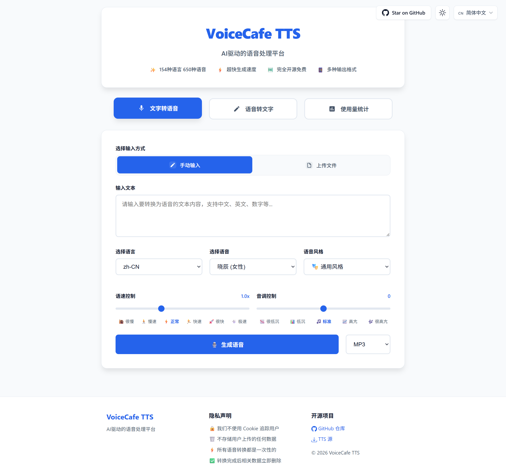

# 🎙️ VoiceCafe TTS - AI驱动的语音处理平台

[English](../README.md) | [简体中文](README_zh-CN.md) | [繁體中文](README_zh-TW.md) | [日本語](README_ja.md)

一个功能强大的AI语音处理平台，集成了文字转语音(TTS)和语音转文字(STT)双向功能。基于Microsoft Edge TTS和硅基流动API，支持154种语言的650+种语音选项。

**🌐 在线演示**: [https://tts.reincarnatey.net/](https://tts.reincarnatey.net/)

## 📸 界面截图



## ✨ 特性

### 🎯 核心功能
- 🗣️ **文字转语音(TTS)** - 基于Microsoft Edge TTS，支持154种语言的650+种语音
- 🎧 **语音转文字(STT)** - 集成硅基流动API，高精度语音识别
- 🔄 **双向处理** - 语音与文字无缝转换
- 🌍 **多语言支持** - 9种界面语言：英语、简体中文、繁体中文、日语、韩语、西班牙语、法语、德语、俄语

### 🎨 用户体验
- ⚡ **秒速生成** - 快速生成高质量语音文件和转录文本
- 🆓 **完全免费** - 无需注册，无使用限制
- 📱 **响应式设计** - 完美适配桌面端和移动端
- 🎛️ **丰富参数** - 支持语速、音调、语音风格等多种调节
- 📥 **支持下载** - 生成的音频可导出为MP3、WAV等多种格式
- 📋 **便捷操作** - 转录结果可复制、编辑，支持转为语音功能

### 🔧 技术特性
- 🔗 **API兼容** - 兼容OpenAI TTS API格式
- 🎵 **多音频格式** - 支持MP3、WAV、M4A、FLAC、AAC、OGG、WebM、AMR、3GP
- 🔐 **灵活配置** - 支持默认Token和自定义Token配置
- 🎨 **现代化UI** - 优雅的卡片式设计，直观的模式切换
- 📊 **可选统计** - 支持KV/D1存储的使用量统计，默认禁用
- 📥 **TTS源导出** - 支持导出TTS配置供第三方软件使用

## 🚀 快速部署

### 一键部署到Cloudflare Workers

[](https://deploy.workers.cloudflare.com/?url=https://github.com/Raincarnator/VoiceCafe-TTS)

**注意**：部署后需要配置环境变量才能启用语音转文字(STT)和统计功能，详见[配置说明](#️-配置说明)章节。

## 📖 使用方法

### 🌐 网页界面

#### 文字转语音模式
1. 访问部署后的Worker域名
2. 确保当前为"文字转语音"模式（默认模式）
3. 选择输入方式：手动输入或上传.txt文件
4. 输入文本或上传文件
5. 选择语音、语速、音调、风格等参数
6. 点击"生成语音"按钮
7. 播放生成的音频或下载为MP3

#### 语音转文字模式
1. 点击页面顶部的"语音转文字"按钮切换模式
2. 上传音频文件（支持9种格式，最大25MB）
3. 使用默认API Token或输入自定义API Token
4. 点击"开始转录"按钮
5. 查看转录结果，支持复制、编辑或转为语音

#### 🌍 语言切换
- 点击右上角的语言切换器
- 支持9种语言，自动保存偏好设置
- UI语言自动映射到对应的TTS语言区域

### 🔌 API调用

#### 文字转语音API

**端点**: `POST /v1/audio/speech`

```javascript
// JavaScript 示例
const response = await fetch('https://your-worker.workers.dev/v1/audio/speech', {
    method: 'POST',
    headers: {
        'Content-Type': 'application/json',
    },
    body: JSON.stringify({
        input: "你好，这是一个测试",
        voice: "zh-CN-XiaoxiaoNeural",
        speed: 1.0,
        pitch: "0",
        style: "general",
        response_format: "mp3"
    })
});

const audioBlob = await response.blob();
```

```bash
# cURL 示例
curl -X POST "https://your-worker.workers.dev/v1/audio/speech" \
  -H "Content-Type: application/json" \
  -d '{
    "input": "你好，这是一个测试",
    "voice": "zh-CN-XiaoxiaoNeural",
    "speed": 1.0,
    "pitch": "0",
    "style": "general",
    "response_format": "mp3"
  }' \
  --output speech.mp3
```

**参数说明**:

| 参数 | 类型 | 默认值 | 说明 |
|------|------|--------|------|
| `input` | string | - | 要转换的文本内容（必填） |
| `voice` | string | `zh-CN-XiaoxiaoNeural` | 语音选择 |
| `speed` | number | `1.0` | 语速 (0.5-2.0) |
| `pitch` | string | `"0"` | 音调 (-50 到 50) |
| `style` | string | `"general"` | 语音风格 |
| `response_format` | string | `"mp3"` | 输出格式 (mp3, wav, opus, flac, aac, ogg, webm, amr, 3gp) |

#### 语音转文字API

**端点**: `POST /v1/audio/transcriptions`

```javascript
// JavaScript 示例
const formData = new FormData();
formData.append('file', audioFile); // 音频文件
formData.append('token', 'your-siliconflow-token'); // 如已配置环境变量则可选

const response = await fetch('https://your-worker.workers.dev/v1/audio/transcriptions', {
    method: 'POST',
    body: formData
});

const result = await response.json();
console.log(result.text); // 转录结果
```

```bash
# cURL 示例
curl -X POST "https://your-worker.workers.dev/v1/audio/transcriptions" \
  -F "file=@audio.mp3" \
  -F "token=your-siliconflow-token"
```

**参数说明**:

| 参数 | 类型 | 默认值 | 说明 |
|------|------|--------|------|
| `file` | File | - | 音频文件（必填，支持多种格式） |
| `token` | string | 环境变量 | 硅基流动API Token（如已配置环境变量则可选） |

**支持的音频格式**: mp3, wav, m4a, flac, aac, ogg, webm, amr, 3gp（最大25MB）

#### 语音列表API

**端点**: `GET /v1/voices?locale={locale}`

```bash
# 获取所有语音
curl https://your-worker.workers.dev/v1/voices

# 获取特定语言区域的语音
curl https://your-worker.workers.dev/v1/voices?locale=zh-CN
```

#### 语言区域列表API

**端点**: `GET /v1/locales`

```bash
curl https://your-worker.workers.dev/v1/locales
```

#### TTS源导出API

**端点**: `GET /tts.json?lang={locales}`

```bash
# 导出所有语言
curl https://your-worker.workers.dev/tts.json

# 导出特定语言
curl https://your-worker.workers.dev/tts.json?lang=zh-CN

# 导出多个语言
curl https://your-worker.workers.dev/tts.json?lang=zh-CN+en-US
```

#### 统计数据API（如已启用）

**端点**: `GET /v1/stats`

```bash
curl https://your-worker.workers.dev/v1/stats
```

## ⚙️ 配置说明

### 方式1：通过网页控制台配置（适用于一键部署）

适用场景：使用一键部署按钮部署后，或需要修改已部署的 Worker 配置。

#### 步骤1：配置环境变量（可选）

如需启用默认STT功能或Google Analytics，可配置以下环境变量：

1. 登录 [Cloudflare Dashboard](https://dash.cloudflare.com/)
2. 选择 **Compute → Workers & Pages**
3. 点击你的 Worker 进入详情页
4. 选择 **Settings** 标签
5. 在 **Variables and Secrets** 部分点击 **Add**
6. 在右侧栏中配置变量：
   - **Type**: 选择 `Text`（普通变量）或 `Secret`（敏感信息，推荐用于 API Key）
   - **Variable name**: 输入变量名（例如：`SILICONFLOW_API_KEY`）
   - **Value**: 输入变量值（例如：`sk-xxxxx`）
7. 点击右下角的 **Deploy** 完成添加

**可选环境变量配置**：

| 变量名 | Type | 说明 | 可选值/示例值 | 默认值 |
|--------|------|------|--------------|--------|
| `SILICONFLOW_API_KEY` | Secret | 硅基流动API密钥，用于启用默认语音转文字功能。若不配置，用户需在使用STT时提供自定义API Key。从[硅基流动](https://cloud.siliconflow.cn/)获取API密钥 | `sk-xxxxx` | 无 |
| `STATS_TYPE` | Text | 统计模式 | `none`、`kv`、`d1` | `none` |
| `GA_MEASUREMENT_ID` | Text | Google Analytics 测量ID | `G-XXXXXXXXXX` | 无 |

#### 步骤2：配置统计功能（可选）

**选项A：禁用统计（默认）**

不需要任何配置，统计功能默认禁用。

**选项B：启用KV存储统计**

1. 在 Cloudflare Dashboard 中选择 **Storage & databases → Workers KV**
2. 点击 **Create Instance**
3. 在 **Namespace name** 中输入名称（例如：`voicecafe-stats` 或自定义名称）
4. 点击 **Create** 创建命名空间
5. 返回 **Compute → Workers & Pages**，选择你的 Worker
6. 选择 **Bindings** 标签
7. 点击 **Add binding**，选择 **KV namespace**
8. 点击 **Add Binding**
9. 在弹出的配置中：
   - **Variable name**: 输入 `STATS_KV`（固定，不要修改）
   - **KV namespace**: 选择刚创建的命名空间
10. 点击 **Add Binding** 完成绑定
11. 返回 **Settings** 标签，在 **Variables and Secrets** 部分：
    - 如果已有 `STATS_TYPE` 变量：点击编辑按钮，修改 **Value** 为 `kv`，点击右下角的 **Deploy**
    - 如果没有 `STATS_TYPE` 变量：点击 **Add**，在右侧栏中 **Type** 选 `Text`，**Variable name** 填 `STATS_TYPE`，**Value** 填 `kv`，点击右下角的 **Deploy**

**选项C：启用D1数据库统计（推荐）**

1. 在 Cloudflare Dashboard 中选择 **Storage & databases → D1 SQL database**
2. 点击 **Create Database**
3. 在 **Name** 中输入名称（例如：`voicecafe-stats` 或自定义名称）
4. 点击 **Create** 创建数据库
5. 返回 **Compute → Workers & Pages**，选择你的 Worker
6. 选择 **Bindings** 标签
7. 点击 **Add binding**，选择 **D1 database**
8. 点击 **Add Binding**
9. 在弹出的配置中：
   - **Variable name**: 输入 `STATS_DB`（固定，不要修改）
   - **D1 database**: 选择刚创建的数据库
10. 点击 **Add Binding** 完成绑定
11. 返回 **Settings** 标签，在 **Variables and Secrets** 部分：
    - 如果已有 `STATS_TYPE` 变量：点击编辑按钮，修改 **Value** 为 `d1`，点击右下角的 **Deploy**
    - 如果没有 `STATS_TYPE` 变量：点击 **Add**，在右侧栏中 **Type** 选 `Text`，**Variable name** 填 `STATS_TYPE`，**Value** 填 `d1`，点击右下角的 **Deploy**

**注意**：数据库表会在首次使用时自动创建，无需手动初始化。

### 方式2：通过 wrangler.toml + 命令行配置（适用于本地部署）

适用场景：从本地使用 `wrangler deploy` 命令部署。

#### 步骤1：配置 wrangler.toml

编辑项目根目录的 `wrangler.toml` 文件：

```toml
[vars]
# 统计模式: "none"（默认）、"kv" 或 "d1"
STATS_TYPE = "none"

# Google Analytics 测量ID（可选）
GA_MEASUREMENT_ID = "G-XXXXXXXXXX"
```

#### 步骤2：配置硅基流动 API Key（可选）

若要启用默认STT功能，使用 `wrangler secret` 命令配置（推荐，密钥不会暴露在配置文件中）：

```bash
wrangler secret put SILICONFLOW_API_KEY
# 按提示输入你的 API Key
```

或者在 `wrangler.toml` 中配置（仅用于本地开发测试）：

```toml
[vars]
SILICONFLOW_API_KEY = "your-api-key-here"  # 注意：不要提交到 Git
```

**说明**：若不配置此 API Key，用户在使用 STT 功能时需要提供自定义 API Key。

#### 步骤3：配置统计功能（可选）

**选项A：禁用统计（默认）**

保持 `STATS_TYPE = "none"` 即可，无需其他配置。

**选项B：启用KV存储统计**

1. 创建KV命名空间：

```bash
# 创建生产环境KV命名空间（名称可自定义，例如：voicecafe-stats）
wrangler kv namespace create "voicecafe-stats"
# 输出示例: id = "abc123def456..."

# 创建预览环境KV命名空间（用于本地开发）
wrangler kv namespace create "voicecafe-stats" --preview
# 输出示例: preview_id = "xyz789uvw012..."
```

2. 在 `wrangler.toml` 中配置：

```toml
[vars]
STATS_TYPE = "kv"

[[kv_namespaces]]
binding = "STATS_KV"
id = "abc123def456..."              # 替换为上面命令输出的 id
preview_id = "xyz789uvw012..."      # 替换为上面命令输出的 preview_id
```

**参数说明**：
- `binding`: 绑定名称，代码中通过 `env.STATS_KV` 访问，**固定为 STATS_KV，不要修改**
- `id`: KV命名空间的生产环境ID
- `preview_id`: KV命名空间的预览环境ID，用于本地开发

**查看已有的KV命名空间**：
```bash
wrangler kv namespace list
```

**选项C：启用D1数据库统计（推荐）**

1. 创建D1数据库：

```bash
# 数据库名称可自定义，例如：voicecafe-stats
wrangler d1 create voicecafe-stats
# 输出示例: database_id = "12345678-abcd-1234-abcd-123456789abc"
```

2. 在 `wrangler.toml` 中配置：

```toml
[vars]
STATS_TYPE = "d1"

[[d1_databases]]
binding = "STATS_DB"
database_name = "voicecafe-stats"
database_id = "12345678-abcd-1234-abcd-123456789abc"  # 替换为上面命令输出的 database_id
```

**参数说明**：
- `binding`: 绑定名称，代码中通过 `env.STATS_DB` 访问，**固定为 STATS_DB，不要修改**
- `database_name`: 数据库名称，可自定义（例如：voicecafe-stats）
- `database_id`: D1数据库的唯一标识符

**查看已有的D1数据库**：
```bash
wrangler d1 list
```

**数据库表自动创建**：首次使用时，系统会自动创建所需的统计表。

## 🏗️ 项目架构

### 技术栈

**前端**:
- 现代化HTML5 + CSS3 + 原生JavaScript
- 无外部依赖（统计图表使用 ECharts 动态加载）
- CSS变量实现的响应式设计
- 内置国际化支持（9种语言）
- ECharts 用于统计数据可视化（热力图和趋势图）

**后端**:
- Cloudflare Workers（边缘计算）
- 模块化架构，清晰的关注点分离
- 面向服务的设计模式

**TTS引擎**:
- Microsoft Edge TTS
- 154种语言的650+种语音
- 多种语音风格和可调参数

**STT引擎**:
- 硅基流动 FunAudioLLM/SenseVoiceSmall
- 高精度语音识别
- 支持多种音频格式

**存储**（可选）:
- Cloudflare KV用于简单键值统计
- Cloudflare D1用于关系型数据库统计

### 项目结构

```
├── src/
│   ├── config/              # 配置文件
│   │   └── constants.js     # 常量定义
│   ├── data/                # 静态数据
│   │   └── voices-data.js   # 语音数据库
│   ├── handlers/            # 请求处理器
│   │   ├── stt-handler.js   # 语音转文字处理器
│   │   ├── tts-handler.js   # 文字转语音处理器
│   │   ├── voices-handler.js # 语音列表处理器
│   │   ├── stats-handler.js  # 统计数据处理器
│   │   └── tts-source-handler.js # TTS源导出处理器
│   ├── services/            # 核心服务
│   │   ├── tts.js           # TTS服务
│   │   ├── stt.js           # STT服务
│   │   ├── stats-service.js # 统计服务抽象
│   │   ├── kv-stats-service.js # KV统计实现
│   │   ├── d1-stats-service.js # D1统计实现
│   │   └── stats-factory.js # 统计服务工厂
│   ├── utils/               # 工具函数
│   │   ├── cors.js          # CORS头工具
│   │   ├── crypto.js        # 加密工具
│   │   ├── html-loader.js   # HTML加载器
│   │   ├── text.js          # 文本处理工具
│   │   └── xml.js           # XML处理工具
│   └── templates/           # HTML模板
│       ├── index.html       # 主HTML模板
│       └── html-template.js # 生成的模板（自动生成）
├── docs/                    # 文档
│   ├── img/                 # 截图
│   ├── README_zh-CN.md      # 简体中文README
│   ├── README_zh-TW.md      # 繁体中文README
│   └── README_ja.md         # 日语README
├── index.js                 # 主入口文件
├── build.js                 # 构建脚本
├── package.json             # 项目配置
├── wrangler.toml            # Cloudflare Workers配置
└── README.md                # 英文README
```

### 设计模式

- **服务层**: TTS、STT和统计服务的抽象
- **工厂模式**: 统计服务工厂支持不同存储后端
- **处理器模式**: 模块化的请求处理器处理不同端点
- **模板生成**: 构建时HTML模板生成，支持变量注入

## 🛠️ 开发指南

### 前置要求

- Node.js 16+
- npm 或 yarn
- Cloudflare 账号（用于部署）
- 硅基流动 API 密钥（可选，用于STT功能）

### 本地开发

```bash
# 克隆仓库
git clone https://github.com/Raincarnator/VoiceCafe-TTS.git
cd VoiceCafe-TTS

# 安装依赖
npm install

# 配置环境变量
# 编辑 wrangler.toml 文件，根据需要配置 STATS_TYPE、SILICONFLOW_API_KEY 等

# 构建项目（生成HTML模板）
npm run build

# 启动本地开发服务器
npm run dev
```

访问 http://localhost:8787 查看应用。

### 部署

```bash
# 部署到 Cloudflare Workers
npm run deploy

# 设置生产环境密钥（推荐使用 secret 而不是写在 wrangler.toml）
wrangler secret put SILICONFLOW_API_KEY
```

**生产环境配置建议**：
- 敏感信息（如 `SILICONFLOW_API_KEY`）使用 `wrangler secret` 命令或在 Cloudflare 控制台配置
- 非敏感配置（如 `STATS_TYPE`、`GA_MEASUREMENT_ID`）可以写在 `wrangler.toml` 的 `[vars]` 部分

### 构建流程

构建脚本（`build.js`）从 `src/templates/index.html` 读取HTML模板并生成 `src/templates/html-template.js`，包含：
- 转义的模板字符串
- Google Analytics注入支持
- 统计功能启用标志注入

修改HTML模板后运行 `npm run build`。

## 🤝 贡献指南

欢迎贡献！请随时提交Pull Request。

### 如何贡献

1. Fork 本仓库
2. 创建你的特性分支 (`git checkout -b feature/AmazingFeature`)
3. 提交你的更改 (`git commit -m 'Add some AmazingFeature'`)
4. 推送到分支 (`git push origin feature/AmazingFeature`)
5. 开启一个Pull Request

### 开发规范

- 遵循现有代码风格
- 为复杂逻辑添加注释
- 为新功能更新文档
- 提交PR前充分测试

## 📄 许可证

本项目采用MIT许可证 - 详见 [LICENSE](../LICENSE) 文件。

## 🙏 致谢

本项目基于以下项目并受其启发：

- **[wangwangit/tts](https://github.com/wangwangit/tts)** - 原始TTS项目基础
- **[Microsoft Edge TTS](https://azure.microsoft.com/zh-cn/products/ai-services/text-to-speech)** - 高质量语音合成服务
- **[硅基流动](https://cloud.siliconflow.cn/)** - 先进的语音识别API
- **[Cloudflare Workers](https://workers.cloudflare.com/)** - 无服务器计算平台
- **开源社区** - 感谢所有贡献者和用户

## 📞 联系与支持

- **GitHub Issues**: [报告问题或请求功能](https://github.com/Raincarnator/VoiceCafe-TTS/issues)
- **GitHub Discussions**: [提问或分享想法](https://github.com/Raincarnator/VoiceCafe-TTS/discussions)

---

**🎙️ VoiceCafe TTS - 让语音处理更智能，让创意更有声音！**

*从文字到语音，从语音到文字 - AI驱动的完整语音处理解决方案。*
