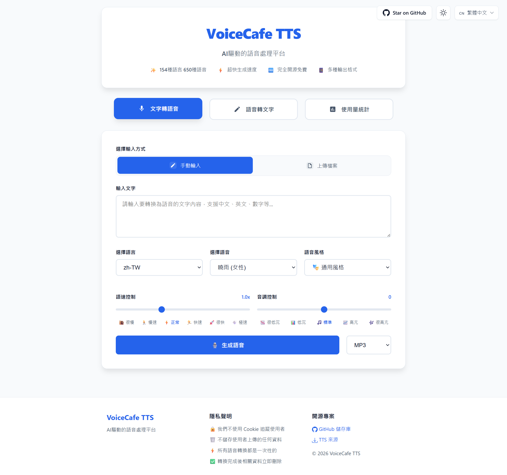

# 🎙️ VoiceCafe TTS - AI驅動的語音處理平台

[English](../README.md) | [简体中文](README_zh-CN.md) | [繁體中文](README_zh-TW.md) | [日本語](README_ja.md)

一個功能強大的AI語音處理平台，整合了文字轉語音(TTS)和語音轉文字(STT)雙向功能。基於Microsoft Edge TTS和矽基流動API，支援154種語言的650+種語音選項。

**🌐 線上展示**: [https://tts.reincarnatey.net/](https://tts.reincarnatey.net/)

## 📸 介面截圖



## ✨ 特性

### 🎯 核心功能
- 🗣️ **文字轉語音(TTS)** - 基於Microsoft Edge TTS，支援154種語言的650+種語音
- 🎧 **語音轉文字(STT)** - 整合矽基流動API，高精度語音辨識
- 🔄 **雙向處理** - 語音與文字無縫轉換
- 🌍 **多語言支援** - 9種介面語言：英語、簡體中文、繁體中文、日語、韓語、西班牙語、法語、德語、俄語

### 🎨 使用者體驗
- ⚡ **秒速生成** - 快速生成高品質語音檔案和轉錄文字
- 🆓 **完全免費** - 無需註冊，無使用限制
- 📱 **響應式設計** - 完美適配桌面端和行動端
- 🎛️ **豐富參數** - 支援語速、音調、語音風格等多種調節
- 📥 **支援下載** - 生成的音訊可匯出為MP3、WAV等多種格式
- 📋 **便捷操作** - 轉錄結果可複製、編輯，支援轉為語音功能

### 🔧 技術特性
- 🔗 **API相容** - 相容OpenAI TTS API格式
- 🎵 **多音訊格式** - 支援MP3、WAV、M4A、FLAC、AAC、OGG、WebM、AMR、3GP
- 🔐 **靈活配置** - 支援預設Token和自訂Token配置
- 🎨 **現代化UI** - 優雅的卡片式設計，直觀的模式切換
- 📊 **可選統計** - 支援KV/D1儲存的使用量統計，預設停用
- 📥 **TTS源匯出** - 支援匯出TTS配置供第三方軟體使用

## 🚀 快速部署

### 一鍵部署到Cloudflare Workers

[](https://deploy.workers.cloudflare.com/?url=https://github.com/Raincarnator/VoiceCafe-TTS)

**注意**：部署後需要配置環境變數才能啟用語音轉文字(STT)和統計功能，詳見[配置說明](#️-配置說明)章節。

## 📖 使用方法

### 🌐 網頁介面

#### 文字轉語音模式
1. 造訪部署後的Worker網域
2. 確保目前為「文字轉語音」模式（預設模式）
3. 選擇輸入方式：手動輸入或上傳.txt檔案
4. 輸入文字或上傳檔案
5. 選擇語音、語速、音調、風格等參數
6. 點擊「生成語音」按鈕
7. 播放生成的音訊或下載為MP3

#### 語音轉文字模式
1. 點擊頁面頂部的「語音轉文字」按鈕切換模式
2. 上傳音訊檔案（支援9種格式，最大25MB）
3. 使用預設API Token或輸入自訂API Token
4. 點擊「開始轉錄」按鈕
5. 檢視轉錄結果，支援複製、編輯或轉為語音

#### 🌍 語言切換
- 點擊右上角的語言切換器
- 支援9種語言，自動儲存偏好設定
- UI語言自動對應到相應的TTS語言區域

### 🔌 API呼叫

#### 文字轉語音API

**端點**: `POST /v1/audio/speech`

```javascript
// JavaScript 範例
const response = await fetch('https://your-worker.workers.dev/v1/audio/speech', {
    method: 'POST',
    headers: {
        'Content-Type': 'application/json',
    },
    body: JSON.stringify({
        input: "你好，這是一個測試",
        voice: "zh-TW-HsiaoChenNeural",
        speed: 1.0,
        pitch: "0",
        style: "general",
        response_format: "mp3"
    })
});

const audioBlob = await response.blob();
```

```bash
# cURL 範例
curl -X POST "https://your-worker.workers.dev/v1/audio/speech" \
  -H "Content-Type: application/json" \
  -d '{
    "input": "你好，這是一個測試",
    "voice": "zh-TW-HsiaoChenNeural",
    "speed": 1.0,
    "pitch": "0",
    "style": "general",
    "response_format": "mp3"
  }' \
  --output speech.mp3
```

**參數說明**:

| 參數 | 類型 | 預設值 | 說明 |
|------|------|--------|------|
| `input` | string | - | 要轉換的文字內容（必填） |
| `voice` | string | `zh-TW-HsiaoChenNeural` | 語音選擇 |
| `speed` | number | `1.0` | 語速 (0.5-2.0) |
| `pitch` | string | `"0"` | 音調 (-50 到 50) |
| `style` | string | `"general"` | 語音風格 |
| `response_format` | string | `"mp3"` | 輸出格式 (mp3, wav, opus, flac, aac, ogg, webm, amr, 3gp) |

#### 語音轉文字API

**端點**: `POST /v1/audio/transcriptions`

```javascript
// JavaScript 範例
const formData = new FormData();
formData.append('file', audioFile); // 音訊檔案
formData.append('token', 'your-siliconflow-token'); // 如已配置環境變數則可選

const response = await fetch('https://your-worker.workers.dev/v1/audio/transcriptions', {
    method: 'POST',
    body: formData
});

const result = await response.json();
console.log(result.text); // 轉錄結果
```

```bash
# cURL 範例
curl -X POST "https://your-worker.workers.dev/v1/audio/transcriptions" \
  -F "file=@audio.mp3" \
  -F "token=your-siliconflow-token"
```

**參數說明**:

| 參數 | 類型 | 預設值 | 說明 |
|------|------|--------|------|
| `file` | File | - | 音訊檔案（必填，支援多種格式） |
| `token` | string | 環境變數 | 矽基流動API Token（如已配置環境變數則可選） |

**支援的音訊格式**: mp3, wav, m4a, flac, aac, ogg, webm, amr, 3gp（最大25MB）

#### 語音列表API

**端點**: `GET /v1/voices?locale={locale}`

```bash
# 取得所有語音
curl https://your-worker.workers.dev/v1/voices

# 取得特定語言區域的語音
curl https://your-worker.workers.dev/v1/voices?locale=zh-TW
```

#### 語言區域列表API

**端點**: `GET /v1/locales`

```bash
curl https://your-worker.workers.dev/v1/locales
```

#### TTS源匯出API

**端點**: `GET /tts.json?lang={locales}`

```bash
# 匯出所有語言
curl https://your-worker.workers.dev/tts.json

# 匯出特定語言
curl https://your-worker.workers.dev/tts.json?lang=zh-TW

# 匯出多個語言
curl https://your-worker.workers.dev/tts.json?lang=zh-TW+zh-HK
```

#### 統計資料API（如已啟用）

**端點**: `GET /v1/stats`

```bash
curl https://your-worker.workers.dev/v1/stats
```

## ⚙️ 配置說明

### 方式1：透過網頁控制台配置（適用於一鍵部署）

適用場景：使用一鍵部署按鈕部署後，或需要修改已部署的 Worker 配置。

#### 步驟1：配置環境變數（可選）

如需啟用預設STT功能或Google Analytics，可配置以下環境變數：

1. 登入 [Cloudflare Dashboard](https://dash.cloudflare.com/)
2. 選擇 **Compute → Workers & Pages**
3. 點擊你的 Worker 進入詳情頁
4. 選擇 **Settings** 標籤
5. 在 **Variables and Secrets** 部分點擊 **Add**
6. 在右側欄中配置變數：
   - **Type**: 選擇 `Text`（普通變數）或 `Secret`（敏感資訊，推薦用於 API Key）
   - **Variable name**: 輸入變數名（例如：`SILICONFLOW_API_KEY`）
   - **Value**: 輸入變數值（例如：`sk-xxxxx`）
7. 點擊右下角的 **Deploy** 完成新增

**可選環境變數配置**：

| 變數名 | Type | 說明 | 可選值/範例值 | 預設值 |
|--------|------|------|--------------|--------|
| `SILICONFLOW_API_KEY` | Secret | 矽基流動API金鑰，用於啟用預設語音轉文字功能。若不配置，使用者需在使用STT時提供自訂API Key。從[矽基流動](https://cloud.siliconflow.cn/)取得API金鑰 | `sk-xxxxx` | 無 |
| `STATS_TYPE` | Text | 統計模式 | `none`、`kv`、`d1` | `none` |
| `GA_MEASUREMENT_ID` | Text | Google Analytics 測量ID | `G-XXXXXXXXXX` | 無 |

#### 步驟2：配置統計功能（可選）

**選項A：停用統計（預設）**

不需要任何配置，統計功能預設停用。

**選項B：啟用KV儲存統計**

1. 在 Cloudflare Dashboard 中選擇 **Storage & databases → Workers KV**
2. 點擊 **Create Instance**
3. 在 **Namespace name** 中輸入名稱（例如：`voicecafe-stats` 或自訂名稱）
4. 點擊 **Create** 建立命名空間
5. 返回 **Compute → Workers & Pages**，選擇你的 Worker
6. 選擇 **Bindings** 標籤
7. 點擊 **Add binding**，選擇 **KV namespace**
8. 點擊 **Add Binding**
9. 在彈出的配置中：
   - **Variable name**: 輸入 `STATS_KV`（固定，不要修改）
   - **KV namespace**: 選擇剛建立的命名空間
10. 點擊 **Add Binding** 完成繫結
11. 返回 **Settings** 標籤，在 **Variables and Secrets** 部分：
    - 如果已有 `STATS_TYPE` 變數：點擊編輯按鈕，修改 **Value** 為 `kv`，點擊右下角的 **Deploy**
    - 如果沒有 `STATS_TYPE` 變數：點擊 **Add**，在右側欄中 **Type** 選 `Text`，**Variable name** 填 `STATS_TYPE`，**Value** 填 `kv`，點擊右下角的 **Deploy**

**選項C：啟用D1資料庫統計（推薦）**

1. 在 Cloudflare Dashboard 中選擇 **Storage & databases → D1 SQL database**
2. 點擊 **Create Database**
3. 在 **Name** 中輸入名稱（例如：`voicecafe-stats` 或自訂名稱）
4. 點擊 **Create** 建立資料庫
5. 返回 **Compute → Workers & Pages**，選擇你的 Worker
6. 選擇 **Bindings** 標籤
7. 點擊 **Add binding**，選擇 **D1 database**
8. 點擊 **Add Binding**
9. 在彈出的配置中：
   - **Variable name**: 輸入 `STATS_DB`（固定，不要修改）
   - **D1 database**: 選擇剛建立的資料庫
10. 點擊 **Add Binding** 完成繫結
11. 返回 **Settings** 標籤，在 **Variables and Secrets** 部分：
    - 如果已有 `STATS_TYPE` 變數：點擊編輯按鈕，修改 **Value** 為 `d1`，點擊右下角的 **Deploy**
    - 如果沒有 `STATS_TYPE` 變數：點擊 **Add**，在右側欄中 **Type** 選 `Text`，**Variable name** 填 `STATS_TYPE`，**Value** 填 `d1`，點擊右下角的 **Deploy**

**注意**：資料庫表會在首次使用時自動建立，無需手動初始化。

### 方式2：透過 wrangler.toml + 命令列配置（適用於本地部署）

適用場景：從本地使用 `wrangler deploy` 命令部署。

#### 步驟1：配置 wrangler.toml

編輯專案根目錄的 `wrangler.toml` 檔案：

```toml
[vars]
# 統計模式: "none"（預設）、"kv" 或 "d1"
STATS_TYPE = "none"

# Google Analytics 測量ID（可選）
GA_MEASUREMENT_ID = "G-XXXXXXXXXX"
```

#### 步驟2：配置矽基流動 API Key（可選）

若要啟用預設STT功能，使用 `wrangler secret` 命令配置（推薦，金鑰不會暴露在配置檔案中）：

```bash
wrangler secret put SILICONFLOW_API_KEY
# 按提示輸入你的 API Key
```

或者在 `wrangler.toml` 中配置（僅用於本地開發測試）：

```toml
[vars]
SILICONFLOW_API_KEY = "your-api-key-here"  # 注意：不要提交到 Git
```

**說明**：若不配置此 API Key，使用者在使用 STT 功能時需要提供自訂 API Key。

#### 步驟3：配置統計功能（可選）

**選項A：停用統計（預設）**

保持 `STATS_TYPE = "none"` 即可，無需其他配置。

**選項B：啟用KV儲存統計**

1. 建立KV命名空間：

```bash
# 建立生產環境KV命名空間（名稱可自訂，例如：voicecafe-stats）
wrangler kv namespace create "voicecafe-stats"
# 輸出範例: id = "abc123def456..."

# 建立預覽環境KV命名空間（用於本地開發）
wrangler kv namespace create "voicecafe-stats" --preview
# 輸出範例: preview_id = "xyz789uvw012..."
```

2. 在 `wrangler.toml` 中配置：

```toml
[vars]
STATS_TYPE = "kv"

[[kv_namespaces]]
binding = "STATS_KV"
id = "abc123def456..."              # 替換為上面命令輸出的 id
preview_id = "xyz789uvw012..."      # 替換為上面命令輸出的 preview_id
```

**參數說明**：
- `binding`: 繫結名稱，程式碼中透過 `env.STATS_KV` 存取，**固定為 STATS_KV，不要修改**
- `id`: KV命名空間的生產環境ID
- `preview_id`: KV命名空間的預覽環境ID，用於本地開發

**檢視已有的KV命名空間**：
```bash
wrangler kv namespace list
```

**選項C：啟用D1資料庫統計（推薦）**

1. 建立D1資料庫：

```bash
# 資料庫名稱可自訂，例如：voicecafe-stats
wrangler d1 create voicecafe-stats
# 輸出範例: database_id = "12345678-abcd-1234-abcd-123456789abc"
```

2. 在 `wrangler.toml` 中配置：

```toml
[vars]
STATS_TYPE = "d1"

[[d1_databases]]
binding = "STATS_DB"
database_name = "voicecafe-stats"
database_id = "12345678-abcd-1234-abcd-123456789abc"  # 替換為上面命令輸出的 database_id
```

**參數說明**：
- `binding`: 繫結名稱，程式碼中透過 `env.STATS_DB` 存取，**固定為 STATS_DB，不要修改**
- `database_name`: 資料庫名稱，可自訂（例如：voicecafe-stats）
- `database_id`: D1資料庫的唯一識別碼

**檢視已有的D1資料庫**：
```bash
wrangler d1 list
```

**資料庫表自動建立**：首次使用時，系統會自動建立所需的統計表。

## 🏗️ 專案架構

### 技術棧

**前端**:
- 現代化HTML5 + CSS3 + 原生JavaScript
- 無外部相依性（統計圖表使用 ECharts 動態載入）
- CSS變數實現的響應式設計
- 內建國際化支援（9種語言）
- ECharts 用於統計資料視覺化（熱力圖和趨勢圖）

**後端**:
- Cloudflare Workers（邊緣運算）
- 模組化架構，清晰的關注點分離
- 面向服務的設計模式

**TTS引擎**:
- Microsoft Edge TTS
- 154種語言的650+種語音
- 多種語音風格和可調參數

**STT引擎**:
- 矽基流動 FunAudioLLM/SenseVoiceSmall
- 高精度語音辨識
- 支援多種音訊格式

**儲存**（可選）:
- Cloudflare KV用於簡單鍵值統計
- Cloudflare D1用於關聯式資料庫統計

### 專案結構

```
├── src/
│   ├── config/              # 配置檔案
│   │   └── constants.js     # 常數定義
│   ├── data/                # 靜態資料
│   │   └── voices-data.js   # 語音資料庫
│   ├── handlers/            # 請求處理器
│   │   ├── stt-handler.js   # 語音轉文字處理器
│   │   ├── tts-handler.js   # 文字轉語音處理器
│   │   ├── voices-handler.js # 語音列表處理器
│   │   ├── stats-handler.js  # 統計資料處理器
│   │   └── tts-source-handler.js # TTS源匯出處理器
│   ├── services/            # 核心服務
│   │   ├── tts.js           # TTS服務
│   │   ├── stt.js           # STT服務
│   │   ├── stats-service.js # 統計服務抽象
│   │   ├── kv-stats-service.js # KV統計實作
│   │   ├── d1-stats-service.js # D1統計實作
│   │   └── stats-factory.js # 統計服務工廠
│   ├── utils/               # 工具函式
│   │   ├── cors.js          # CORS標頭工具
│   │   ├── crypto.js        # 加密工具
│   │   ├── html-loader.js   # HTML載入器
│   │   ├── text.js          # 文字處理工具
│   │   └── xml.js           # XML處理工具
│   └── templates/           # HTML範本
│       ├── index.html       # 主HTML範本
│       └── html-template.js # 生成的範本（自動生成）
├── docs/                    # 文件
│   ├── img/                 # 截圖
│   ├── README_zh-CN.md      # 簡體中文README
│   ├── README_zh-TW.md      # 繁體中文README
│   └── README_ja.md         # 日語README
├── index.js                 # 主入口檔案
├── build.js                 # 建置指令碼
├── package.json             # 專案配置
├── wrangler.toml            # Cloudflare Workers配置
└── README.md                # 英文README
```

### 設計模式

- **服務層**: TTS、STT和統計服務的抽象
- **工廠模式**: 統計服務工廠支援不同儲存後端
- **處理器模式**: 模組化的請求處理器處理不同端點
- **範本生成**: 建置時HTML範本生成，支援變數注入

## 🛠️ 開發指南

### 前置要求

- Node.js 16+
- npm 或 yarn
- Cloudflare 帳號（用於部署）
- 矽基流動 API 金鑰（可選，用於STT功能）

### 本地開發

```bash
# 複製儲存庫
git clone https://github.com/Raincarnator/VoiceCafe-TTS.git
cd VoiceCafe-TTS

# 安裝相依性
npm install

# 配置環境變數
# 編輯 wrangler.toml 檔案，根據需要配置 STATS_TYPE、SILICONFLOW_API_KEY 等

# 建置專案（生成HTML範本）
npm run build

# 啟動本地開發伺服器
npm run dev
```

造訪 http://localhost:8787 檢視應用程式。

### 部署

```bash
# 部署到 Cloudflare Workers
npm run deploy

# 設定生產環境金鑰（推薦使用 secret 而不是寫在 wrangler.toml）
wrangler secret put SILICONFLOW_API_KEY
```

**生產環境配置建議**：
- 敏感資訊（如 `SILICONFLOW_API_KEY`）使用 `wrangler secret` 命令或在 Cloudflare 控制台配置
- 非敏感配置（如 `STATS_TYPE`、`GA_MEASUREMENT_ID`）可以寫在 `wrangler.toml` 的 `[vars]` 部分

### 建置流程

建置指令碼（`build.js`）從 `src/templates/index.html` 讀取HTML範本並生成 `src/templates/html-template.js`，包含：
- 轉義的範本字串
- Google Analytics注入支援
- 統計功能啟用標誌注入

修改HTML範本後執行 `npm run build`。

## 🤝 貢獻指南

歡迎貢獻！請隨時提交Pull Request。

### 如何貢獻

1. Fork 本儲存庫
2. 建立你的特性分支 (`git checkout -b feature/AmazingFeature`)
3. 提交你的更改 (`git commit -m 'Add some AmazingFeature'`)
4. 推送到分支 (`git push origin feature/AmazingFeature`)
5. 開啟一個Pull Request

### 開發規範

- 遵循現有程式碼風格
- 為複雜邏輯新增註解
- 為新功能更新文件
- 提交PR前充分測試

## 📄 授權條款

本專案採用MIT授權條款 - 詳見 [LICENSE](../LICENSE) 檔案。

## 🙏 致謝

本專案基於以下專案並受其啟發：

- **[wangwangit/tts](https://github.com/wangwangit/tts)** - 原始TTS專案基礎
- **[Microsoft Edge TTS](https://azure.microsoft.com/zh-tw/products/ai-services/text-to-speech)** - 高品質語音合成服務
- **[矽基流動](https://cloud.siliconflow.cn/)** - 先進的語音辨識API
- **[Cloudflare Workers](https://workers.cloudflare.com/)** - 無伺服器運算平台
- **開源社群** - 感謝所有貢獻者和使用者

## 📞 聯絡與支援

- **GitHub Issues**: [回報問題或請求功能](https://github.com/Raincarnator/VoiceCafe-TTS/issues)
- **GitHub Discussions**: [提問或分享想法](https://github.com/Raincarnator/VoiceCafe-TTS/discussions)

---

**🎙️ VoiceCafe TTS - 讓語音處理更智慧，讓創意更有聲音！**

*從文字到語音，從語音到文字 - AI驅動的完整語音處理解決方案。*
